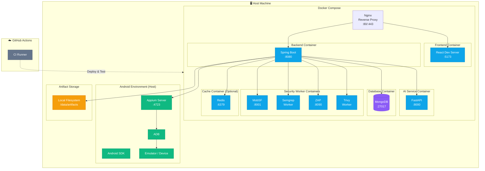

# CI/CD Pipeline

```mermaid
flowchart LR
    subgraph Trigger["🔔 Trigger"]
        PUSH["Git Push / PR"]
        WEBHOOK["Webhook"]
    end

    subgraph Build["🔨 Build & Test"]
        CHECKOUT["Checkout<br/>Verify permissions"]
        COMPILE["Build Services<br/>Unit Tests"]
    end

    subgraph StaticAnalysis["🔍 Static Analysis"]
        SAST["SAST<br/>Semgrep"]
        DEPS["Dependency Scan<br/>Trivy / Dependabot"]
        SECRETS["Secret Scan"]
    end

    subgraph ContainerPhase["📦 Container"]
        DOCKER_BUILD["Build Images"]
        CONTAINER_SCAN["Trivy Image Scan"]
    end

    subgraph TestEnv["🧪 Test Environment"]
        DEPLOY_STAGE["Deploy Staging<br/>No prod credentials"]
        MOBILE_TEST["Appium Tests<br/>Collect evidence"]
        SEC_SCAN["Security Scan<br/>MobSF + ZAP"]
    end

    subgraph AIPhase["🧠 AI Analysis"]
        DIAGNOSE["Failure Diagnosis"]
        REPAIR["Propose Repairs"]
        VERIFY["Verify Approved<br/>Candidates"]
    end

    subgraph Release["🚀 Release"]
        ASSESS["Risk Assessment<br/>Explainable score"]
        GATE{"Policy Gate<br/>Human Approval?"}
        PUBLISH["Publish Artifacts<br/>Store Reports"]
        REJECT["❌ Block Release"]
    end

    PUSH --> CHECKOUT
    WEBHOOK --> CHECKOUT
    CHECKOUT --> COMPILE

    COMPILE -->|"✅ Pass"| SAST
    COMPILE -->|"❌ Fail"| REJECT

    SAST --> DEPS
    DEPS --> SECRETS
    SECRETS -->|"✅ Below threshold"| DOCKER_BUILD
    SECRETS -->|"❌ Critical findings"| REJECT

    DOCKER_BUILD --> CONTAINER_SCAN
    CONTAINER_SCAN -->|"✅ Pass"| DEPLOY_STAGE
    CONTAINER_SCAN -->|"❌ Critical CVEs"| REJECT

    DEPLOY_STAGE --> MOBILE_TEST
    DEPLOY_STAGE --> SEC_SCAN
    MOBILE_TEST --> DIAGNOSE
    SEC_SCAN --> DIAGNOSE

    DIAGNOSE --> REPAIR
    REPAIR --> VERIFY

    VERIFY --> ASSESS
    ASSESS --> GATE
    GATE -->|"✅ Approved"| PUBLISH
    GATE -->|"❌ Rejected"| REJECT

    style REJECT fill:#ef4444,stroke:#dc2626,color:#fff
    style PUBLISH fill:#10b981,stroke:#059669,color:#fff
    style GATE fill:#f59e0b,stroke:#d97706,color:#fff
```

# Deployment Architecture

```mermaid
graph TB
    subgraph HostMachine["🖥️ Host Machine"]
        subgraph DockerCompose["Docker Compose"]
            NGINX["Nginx<br/>Reverse Proxy<br/>:80/:443"]

            subgraph FrontendContainer["Frontend Container"]
                REACT["React Dev Server<br/>:5173"]
            end

            subgraph BackendContainer["Backend Container"]
                SPRING["Spring Boot<br/>:8080"]
            end

            subgraph AIContainer["AI Service Container"]
                FASTAPI["FastAPI<br/>:8000"]
            end

            subgraph DBContainer["Database Container"]
                MONGODB[("MongoDB<br/>:27017")]
            end

            subgraph SecurityContainers["Security Worker Containers"]
                MOBSF_C["MobSF<br/>:8001"]
                SEMGREP_C["Semgrep<br/>Worker"]
                ZAP_C["ZAP<br/>:8090"]
                TRIVY_C["Trivy<br/>Worker"]
            end

            subgraph CacheContainer["Cache Container (Optional)"]
                REDIS_C["Redis<br/>:6379"]
            end
        end

        subgraph AndroidEnv["Android Environment (Host)"]
            SDK["Android SDK"]
            ADB["ADB"]
            APPIUM_S["Appium Server<br/>:4723"]
            EMU_S["Emulator / Device"]
        end

        subgraph Storage["Artifact Storage"]
            LOCAL_FS["Local Filesystem<br/>/data/artifacts"]
        end
    end

    subgraph CI["☁️ GitHub Actions"]
        RUNNER["CI Runner"]
    end

    NGINX --> REACT
    NGINX --> SPRING
    SPRING --> MONGODB
    SPRING --> FASTAPI
    SPRING --> REDIS_C
    SPRING --> MOBSF_C
    SPRING --> SEMGREP_C
    SPRING --> ZAP_C
    SPRING --> TRIVY_C
    SPRING --> APPIUM_S
    SPRING --> LOCAL_FS
    APPIUM_S --> ADB
    ADB --> EMU_S
    RUNNER -.->|"Deploy & Test"| DockerCompose

    classDef container fill:#0ea5e9,stroke:#0284c7,color:#fff
    classDef db fill:#8b5cf6,stroke:#7c3aed,color:#fff
    classDef android fill:#10b981,stroke:#059669,color:#fff
    classDef ci fill:#64748b,stroke:#475569,color:#fff
    classDef storage fill:#f59e0b,stroke:#d97706,color:#fff

    class REACT,SPRING,FASTAPI,MOBSF_C,SEMGREP_C,ZAP_C,TRIVY_C,REDIS_C container
    class MONGODB db
    class SDK,ADB,APPIUM_S,EMU_S android
    class RUNNER ci
    class LOCAL_FS storage
```
