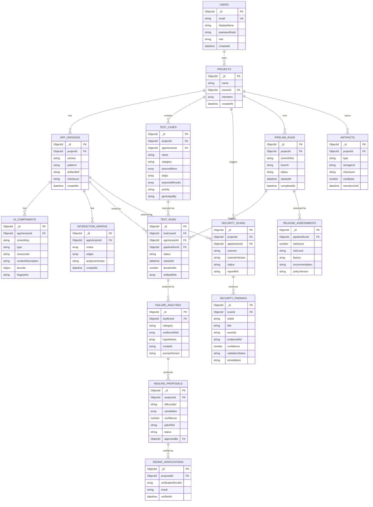

# Entity-Relationship Diagram

```mermaid
erDiagram
    USERS {
        ObjectId _id PK
        string email UK
        string displayName
        string passwordHash
        string role
        datetime createdAt
    }

    PROJECTS {
        ObjectId _id PK
        string name
        ObjectId ownerId FK
        array members
        datetime createdAt
    }

    APP_VERSIONS {
        ObjectId _id PK
        ObjectId projectId FK
        string version
        string platform
        string artifactRef
        string checksum
        datetime createdAt
    }

    UI_COMPONENTS {
        ObjectId _id PK
        ObjectId appVersionId FK
        string screenKey
        string type
        string resourceId
        string contentDescription
        object bounds
        string fingerprint
    }

    INTERACTION_GRAPHS {
        ObjectId _id PK
        ObjectId appVersionId FK
        array nodes
        array edges
        string analyzerVersion
        datetime createdAt
    }

    TEST_CASES {
        ObjectId _id PK
        ObjectId projectId FK
        ObjectId appVersionId FK
        string name
        string category
        array preconditions
        array steps
        array expectedResults
        string priority
        string generatedBy
    }

    TEST_RUNS {
        ObjectId _id PK
        ObjectId testCaseId FK
        ObjectId appVersionId FK
        ObjectId pipelineRunId FK
        string status
        datetime startedAt
        number durationMs
        array artifactRefs
    }

    FAILURE_ANALYSES {
        ObjectId _id PK
        ObjectId testRunId FK
        string category
        array evidenceRefs
        array hypotheses
        string modelId
        string promptVersion
    }

    HEALING_PROPOSALS {
        ObjectId _id PK
        ObjectId analysisId FK
        string oldLocator
        array candidates
        number confidence
        string patchRef
        string status
        ObjectId approvedBy FK
    }

    REPAIR_VERIFICATIONS {
        ObjectId _id PK
        ObjectId proposalId FK
        array verificationRunIds
        string result
        datetime verifiedAt
    }

    SECURITY_SCANS {
        ObjectId _id PK
        ObjectId projectId FK
        ObjectId appVersionId FK
        string scanner
        string scannerVersion
        string status
        string reportRef
    }

    SECURITY_FINDINGS {
        ObjectId _id PK
        ObjectId scanId FK
        string ruleId
        string title
        string severity
        string evidenceRef
        number confidence
        string validationStatus
        string remediation
    }

    PIPELINE_RUNS {
        ObjectId _id PK
        ObjectId projectId FK
        string commitSha
        string branch
        string status
        datetime startedAt
        datetime completedAt
    }

    RELEASE_ASSESSMENTS {
        ObjectId _id PK
        ObjectId pipelineRunId FK
        number riskScore
        string riskLevel
        array factors
        string recommendation
        string policyVersion
    }

    ARTIFACTS {
        ObjectId _id PK
        ObjectId projectId FK
        string type
        string storageUri
        string checksum
        number sizeBytes
        datetime retentionUntil
    }

    USERS ||--o{ PROJECTS : "owns"
    PROJECTS ||--o{ APP_VERSIONS : "has"
    PROJECTS ||--o{ TEST_CASES : "contains"
    PROJECTS ||--o{ SECURITY_SCANS : "triggers"
    PROJECTS ||--o{ PIPELINE_RUNS : "runs"
    PROJECTS ||--o{ ARTIFACTS : "stores"

    APP_VERSIONS ||--o{ UI_COMPONENTS : "has"
    APP_VERSIONS ||--o{ INTERACTION_GRAPHS : "has"
    APP_VERSIONS ||--o{ TEST_RUNS : "tested by"
    APP_VERSIONS ||--o{ SECURITY_SCANS : "scanned by"

    TEST_CASES ||--o{ TEST_RUNS : "executed as"

    TEST_RUNS ||--o{ FAILURE_ANALYSES : "analyzed by"

    FAILURE_ANALYSES ||--o{ HEALING_PROPOSALS : "produces"

    HEALING_PROPOSALS ||--o{ REPAIR_VERIFICATIONS : "verified by"

    SECURITY_SCANS ||--o{ SECURITY_FINDINGS : "produces"

    PIPELINE_RUNS ||--o{ TEST_RUNS : "triggers"
    PIPELINE_RUNS ||--o{ RELEASE_ASSESSMENTS : "assessed by"
```
