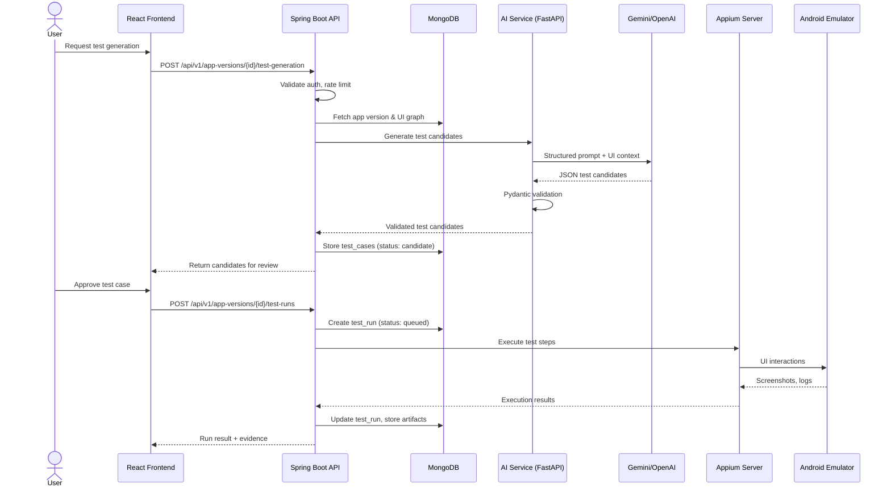
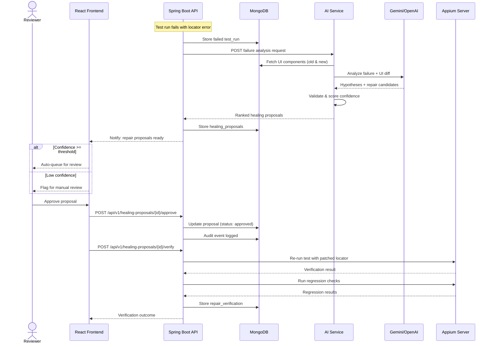
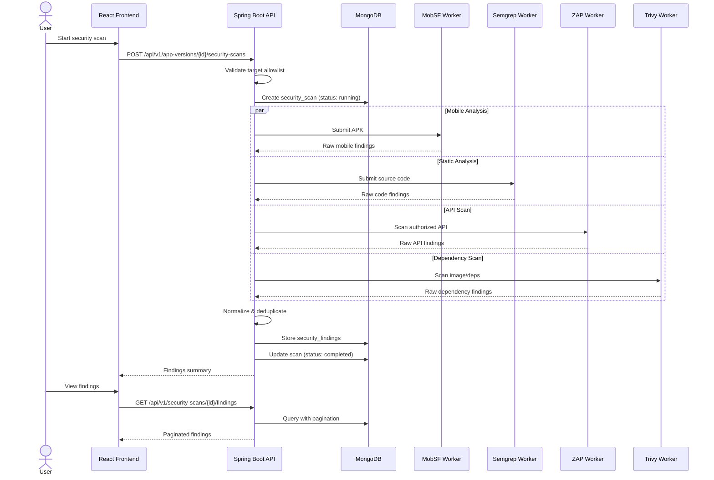
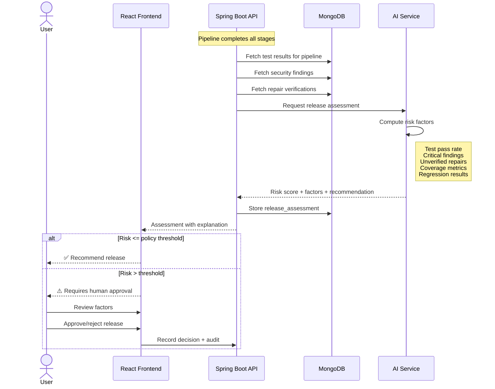

# API Sequence Diagrams

## 1. Test Generation & Execution Flow

```mermaid
sequenceDiagram
    actor User
    participant FE as React Frontend
    participant API as Spring Boot API
    participant DB as MongoDB
    participant AI as AI Service (FastAPI)
    participant LLM as Gemini/OpenAI
    participant APM as Appium Server
    participant EMU as Android Emulator

    User->>FE: Request test generation
    FE->>API: POST /api/v1/app-versions/{id}/test-generation
    API->>API: Validate auth, rate limit
    API->>DB: Fetch app version & UI graph
    API->>AI: Generate test candidates
    AI->>LLM: Structured prompt + UI context
    LLM-->>AI: JSON test candidates
    AI->>AI: Pydantic validation
    AI-->>API: Validated test candidates
    API->>DB: Store test_cases (status: candidate)
    API-->>FE: Return candidates for review

    User->>FE: Approve test case
    FE->>API: POST /api/v1/app-versions/{id}/test-runs
    API->>DB: Create test_run (status: queued)
    API->>APM: Execute test steps
    APM->>EMU: UI interactions
    EMU-->>APM: Screenshots, logs
    APM-->>API: Execution results
    API->>DB: Update test_run, store artifacts
    API-->>FE: Run result + evidence
```

## 2. Self-Healing Flow

```mermaid
sequenceDiagram
    actor Reviewer
    participant FE as React Frontend
    participant API as Spring Boot API
    participant DB as MongoDB
    participant AI as AI Service
    participant LLM as Gemini/OpenAI
    participant APM as Appium Server

    Note over API: Test run fails with locator error
    API->>DB: Store failed test_run
    API->>AI: POST failure analysis request
    AI->>DB: Fetch UI components (old & new)
    AI->>LLM: Analyze failure + UI diff
    LLM-->>AI: Hypotheses + repair candidates
    AI->>AI: Validate & score confidence
    AI-->>API: Ranked healing proposals
    API->>DB: Store healing_proposals

    API-->>FE: Notify: repair proposals ready

    alt Confidence >= threshold
        FE-->>Reviewer: Auto-queue for review
    else Low confidence
        FE-->>Reviewer: Flag for manual review
    end

    Reviewer->>FE: Approve proposal
    FE->>API: POST /api/v1/healing-proposals/{id}/approve
    API->>DB: Update proposal (status: approved)
    API->>DB: Audit event logged

    FE->>API: POST /api/v1/healing-proposals/{id}/verify
    API->>APM: Re-run test with patched locator
    APM-->>API: Verification result
    API->>APM: Run regression checks
    APM-->>API: Regression results
    API->>DB: Store repair_verification
    API-->>FE: Verification outcome
```

## 3. Security Scan Flow

```mermaid
sequenceDiagram
    actor User
    participant FE as React Frontend
    participant API as Spring Boot API
    participant DB as MongoDB
    participant MOBSF as MobSF Worker
    participant SEMG as Semgrep Worker
    participant ZAP as ZAP Worker
    participant TRIVY as Trivy Worker

    User->>FE: Start security scan
    FE->>API: POST /api/v1/app-versions/{id}/security-scans
    API->>API: Validate target allowlist
    API->>DB: Create security_scan (status: running)

    par Mobile Analysis
        API->>MOBSF: Submit APK
        MOBSF-->>API: Raw mobile findings
    and Static Analysis
        API->>SEMG: Submit source code
        SEMG-->>API: Raw code findings
    and API Scan
        API->>ZAP: Scan authorized API
        ZAP-->>API: Raw API findings
    and Dependency Scan
        API->>TRIVY: Scan image/deps
        TRIVY-->>API: Raw dependency findings
    end

    API->>API: Normalize & deduplicate
    API->>DB: Store security_findings
    API->>DB: Update scan (status: completed)
    API-->>FE: Findings summary

    User->>FE: View findings
    FE->>API: GET /api/v1/security-scans/{id}/findings
    API->>DB: Query with pagination
    API-->>FE: Paginated findings
```

## 4. Release Assessment Flow

```mermaid
sequenceDiagram
    actor User
    participant FE as React Frontend
    participant API as Spring Boot API
    participant DB as MongoDB
    participant AI as AI Service

    Note over API: Pipeline completes all stages

    API->>DB: Fetch test results for pipeline
    API->>DB: Fetch security findings
    API->>DB: Fetch repair verifications
    API->>AI: Request release assessment

    AI->>AI: Compute risk factors
    Note right of AI: Test pass rate<br/>Critical findings<br/>Unverified repairs<br/>Coverage metrics<br/>Regression results

    AI-->>API: Risk score + factors + recommendation
    API->>DB: Store release_assessment
    API-->>FE: Assessment with explanation

    alt Risk <= policy threshold
        FE-->>User: ✅ Recommend release
    else Risk > threshold
        FE-->>User: ⚠️ Requires human approval
        User->>FE: Review factors
        User->>FE: Approve/reject release
        FE->>API: Record decision + audit
    end
```
