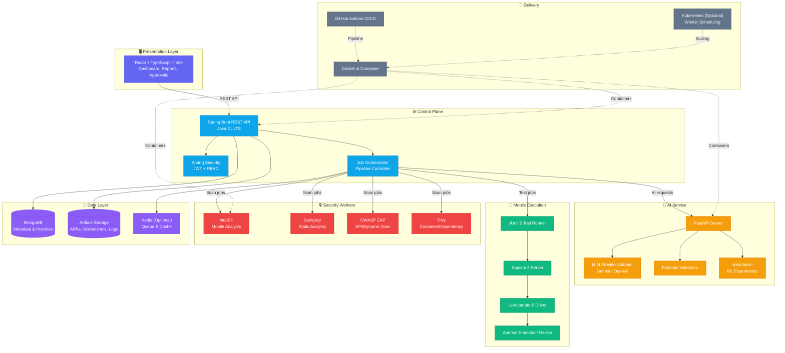

# System Architecture

```mermaid
graph TB
    subgraph Presentation["🖥️ Presentation Layer"]
        FE["React + TypeScript + Vite<br/>Dashboard, Reports, Approvals"]
    end

    subgraph ControlPlane["⚙️ Control Plane"]
        API["Spring Boot REST API<br/>Java 21 LTS"]
        AUTH["Spring Security<br/>JWT + RBAC"]
        ORCH["Job Orchestrator<br/>Pipeline Controller"]
    end

    subgraph AIService["🧠 AI Service"]
        FAST["FastAPI Server"]
        LLM["LLM Provider Adapter<br/>Gemini / OpenAI"]
        VAL["Pydantic Validators"]
        ML["scikit-learn<br/>ML Experiments"]
    end

    subgraph MobileExec["📱 Mobile Execution"]
        APP["Appium 2 Server"]
        UI2["UiAutomator2 Driver"]
        EMU["Android Emulator / Device"]
        JUNIT["JUnit 5 Test Runner"]
    end

    subgraph SecurityWorkers["🔒 Security Workers"]
        MOBSF["MobSF<br/>Mobile Analysis"]
        SEMG["Semgrep<br/>Static Analysis"]
        ZAP["OWASP ZAP<br/>API/Dynamic Scan"]
        TRIVY["Trivy<br/>Container/Dependency"]
    end

    subgraph DataLayer["💾 Data Layer"]
        MONGO[("MongoDB<br/>Metadata & Histories")]
        STORE[("Artifact Storage<br/>APKs, Screenshots, Logs")]
        REDIS["Redis (Optional)<br/>Queue & Cache"]
    end

    subgraph Delivery["🚀 Delivery"]
        DOCKER["Docker & Compose"]
        GHA["GitHub Actions CI/CD"]
        K8S["Kubernetes (Optional)<br/>Worker Scheduling"]
    end

    FE -->|"REST API"| API
    API --> AUTH
    API --> ORCH
    ORCH -->|"Test jobs"| JUNIT
    ORCH -->|"AI requests"| FAST
    ORCH -->|"Scan jobs"| MOBSF
    ORCH -->|"Scan jobs"| SEMG
    ORCH -->|"Scan jobs"| ZAP
    ORCH -->|"Scan jobs"| TRIVY

    FAST --> LLM
    FAST --> VAL
    FAST --> ML

    JUNIT --> APP
    APP --> UI2
    UI2 --> EMU

    API --> MONGO
    API --> STORE
    ORCH --> REDIS

    DOCKER -.->|"Containers"| API
    DOCKER -.->|"Containers"| FAST
    DOCKER -.->|"Containers"| MOBSF
    GHA -.->|"Pipeline"| DOCKER
    K8S -.->|"Scaling"| DOCKER

    classDef presentation fill:#6366f1,stroke:#4f46e5,color:#fff
    classDef control fill:#0ea5e9,stroke:#0284c7,color:#fff
    classDef ai fill:#f59e0b,stroke:#d97706,color:#fff
    classDef mobile fill:#10b981,stroke:#059669,color:#fff
    classDef security fill:#ef4444,stroke:#dc2626,color:#fff
    classDef data fill:#8b5cf6,stroke:#7c3aed,color:#fff
    classDef delivery fill:#64748b,stroke:#475569,color:#fff

    class FE presentation
    class API,AUTH,ORCH control
    class FAST,LLM,VAL,ML ai
    class APP,UI2,EMU,JUNIT mobile
    class MOBSF,SEMG,ZAP,TRIVY security
    class MONGO,STORE,REDIS data
    class DOCKER,GHA,K8S delivery
```
